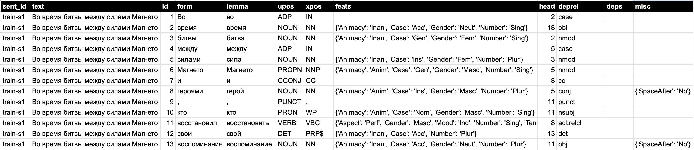
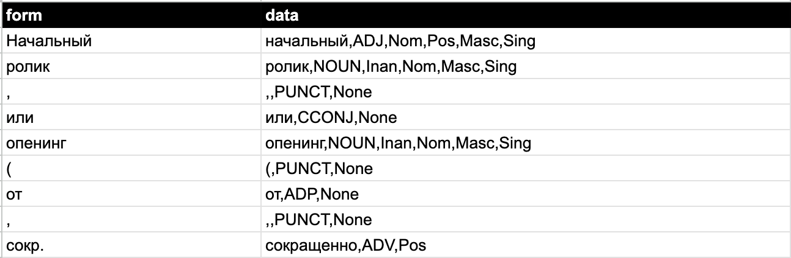

# Дипломная работа на тему: "От нейросетевого анализа к словарному: методы разработки морфологических анализаторов на основе данных, размеченных нейросетью"
## Diploma "From neural network analysis to word analysis: methods for developing morphological analysers based on neural network-marked data
### Автор: _Феоктистова Эмма Александровна, 4 курс ФиКЛ_
### Научный руководитель: _Проф. Ляшевская О. Н._
### Текст дипломной работы: `Дипломная_работа_от_нейроанализа_к_словарному.pdf`
  ---
### 1. Данные:
- Датасет GSD (_train_ - 74900 токенов, _val_ - 11710 токенов, _test_ - 11385 токенов)
- Датасет SynTagRus (_train_ - 1206300 токенов, _val_ - 153590 токенов, _test_ - 157990 токенов)
- Датасет Taiga (_train_ - 176630 токенов, _val_ - 10095 токенов, _test_ - 10275 токенов)

Исользуемые данные в папке `data\raw_data`, предобработанные данные в полном и в сокращенных форматах в папке `data\prepared_data`.

  Пример полного формата данных:  

  
  Пример сокращенного формата данных:  

  
  Все данные находятся по ссылке: https://drive.google.com/drive/u/0/folders/1MFgqQ3WmkVTk22NmeOX1UYWjCvu0l3mL
  
  ---
### 2. Кластеризация
Используемые методы кластеризации:
- K-means
- DBSCAN
- Agglomerative Clustering
- Naive Bayes
- Random Forest

Кластеризованные данные датасетов _GSD_ и _Taiga_ в папке `data\clustered_data`.
 
 Результаты кластеризации данных с помощью метода __K-means__:
 | Датасет | Количество токенов | Количество кластеров | Макс. кол-во токенов в кластере |
 | --- | --- | --- | --- |
 | GSD train  | 74900 | 7490 | 19137 |
 | GSD dev | 11709 | 1170 | 3520 |
 | Taiga train  | 176630 | 3531 | 49172 |
 | Taiga dev | 10095 | 200 | 2988 |
 
 Результаты кластеризации данных с помощью метода __DBSCAN__:
  | Датасет | Количество токенов | Количество кластеров | Макс. кол-во токенов в кластере |
 | --- | --- | --- | --- |
 | GSD train  | 74900 | 6359 | 20294 |
 | GSD dev | 11709 | 982 | 4539 |
 | Taiga train  | 176630 | 3598 | 47349 |
 | Taiga dev | 10095 | 934 | 3458 |
 
  Результаты кластеризации данных с помощью метода __Agglomerative Clustering__:
  | Датасет | Количество токенов | Количество кластеров | Макс. кол-во токенов в кластере |
 | --- | --- | --- | --- |
 | GSD train  | 74900 | 7000 | 18579 |
 | GSD dev | 11709 | 1000 | 7672 |
 | Taiga train  | 176630 | 7000 | 42381 |
 | Taiga dev | 10095 | 1000 | 5643 |
 
 Код для кластеризации с помощью используемых методов: `Clustering_for_prod.ipynb`
 
 ---
### 3. Обучение модели
Выбранные модели для обучения:
- T5
- RuPrompt
Используемые предобученные веса моделей:

---
### 4. Результаты
_Update soon_
